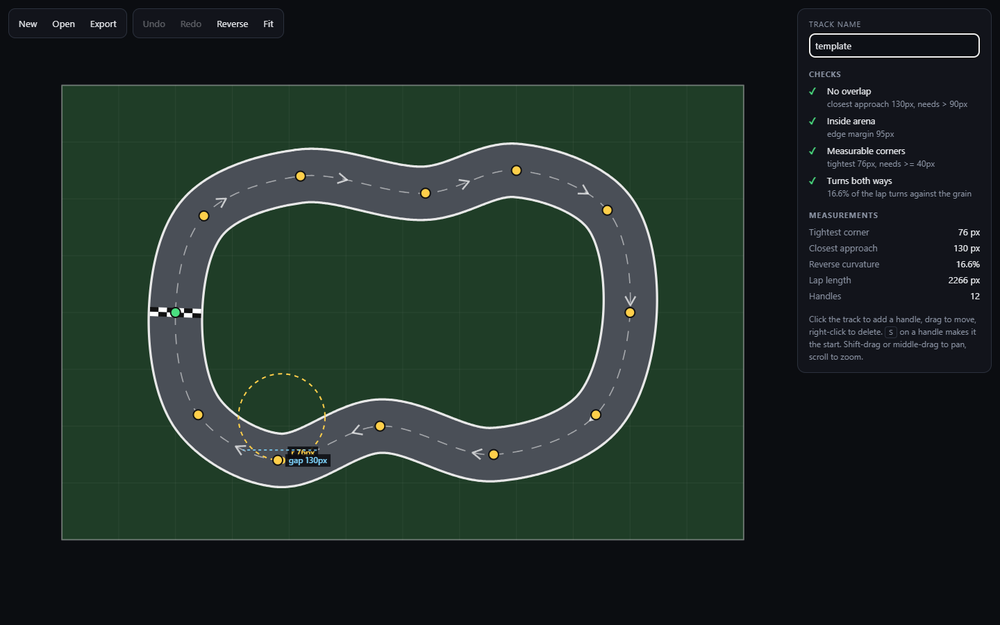
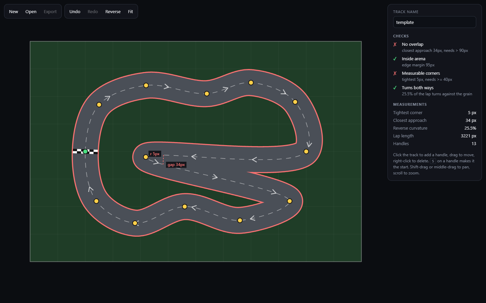

# virtual-world

A track editor for [NeuroRacer](https://github.com/ethanstoner/neuro-racer), my
neuroevolution racing project. You draw a closed track in the browser, and the
editor measures it the way NeuroRacer's trainer will. It rejects shapes the
trainer can't use and exports JSON that NeuroRacer loads anywhere a track name
goes.



### Highlights

- **Checks every edit against NeuroRacer's own numbers.** The corner-radius,
  overlap and arena checks are TypeScript ports of NeuroRacer's numpy code. On a
  file exported from this editor's UI, all five measurements agree with numpy to
  within 0.01. On a test circle the corner radius agrees to 11 significant
  figures.
- **Re-measures on every drag frame**: 3.1 to 3.8ms per full analysis of a
  560 to 640 sample lap, including an O(n²) closest-approach search.
- **Built as tooling for the finding that mattered.** Together with NeuroRacer's
  seeded track generator, the shared file format put 100 unseen tracks in front
  of NeuroRacer's champions. That showed its best "generalising" champion laps
  **0 of 42** counter-clockwise tracks it should have handled, and 0% of its
  own training track reversed
  ([devlog 09](https://github.com/ethanstoner/neuro-racer/blob/main/docs/devlog/09-the-generated-test.md)).

**TypeScript · Canvas 2D · Vite · Vitest**, with no runtime dependencies.

## What it checks

NeuroRacer rasterises a track into per-pixel masks, so some shapes cannot
exist in it at all. The editor shows each check live, and Export is disabled
while any of the first three fails:

| Check | Rule | Why NeuroRacer needs it |
| --- | --- | --- |
| No overlap | parts of the lap more than 1.5 widths apart stay more than 1 width apart | progress is one value per pixel, so overlapping road has ambiguous progress |
| Inside arena | road edge inside the 1200×800 world | the masks are the world |
| Measurable corners | tightest radius ≥ 40px | below that the centerline radius stops describing the corner a car drives: NeuroRacer's champions lap 12px centerline corners on a wider line |
| Turns both ways (warning) | some of the lap curves against the grain | an all-one-way loop can be driven by a fixed steering bias |



The dashed circle is the osculating circle at the centerline's tightest point.
The dashed line joins the two parts of the lap that come closest to each other.

## Architecture

```
handles ──centripetal Catmull-Rom──▶ centerline (2px samples, rounded to 0.01px)
                                          │
                                          ▼ resample to 4px, exactly as NeuroRacer does
                        tightest radius · closest approach · reverse curvature · arena margin
                                          │
                     checks ──▶ side panel, canvas overlays, Export enabled or blocked
                                          │
                                          ▼
                              <name>.track.json ──▶ NeuroRacer --track
```

`src/track/` is pure TypeScript with no DOM, so all of the measuring is unit
tested. `src/editor/` is the canvas UI on top: viewport, handles, undo history.
The whole analysis reruns on every change, 3.1 to 3.8ms per run.

## Engineering highlights

- **Ported the measurements, including numpy's quirks.** `min_centerline_radius`
  uses `np.gradient`, which takes one-sided differences at the ends of the array
  even though the lap is closed. The port does the same, so the editor reads a
  250px circle as 247.67px, exactly as NeuroRacer does, not a "better" 250.
- **Tested parity in both directions.** A file exported from this editor's UI is
  a fixture in NeuroRacer's test suite, and a file written by NeuroRacer is a
  fixture here. Each side must reproduce the other's measurements.
- **Found and fixed a measurement bug on the other side.** Parity testing showed
  that rounding a centerline to 0.01px moves NeuroRacer's corner-radius reading:
  247.7px to 240.1px on a test circle, about 3%. Its writer measured the unrounded
  points, so files carried numbers their own points didn't produce. Both writers
  now measure exactly what they save.
- **Kept imported tracks exact.** Built-in and generated tracks have no editable
  handles. The editor fits handles for display but keeps the original centerline
  until you move one: a spline through fitted handles read a 121px corner as
  106px even at 48 handles, and the editor must not report a corner the file
  doesn't have.
- **Centripetal Catmull-Rom**, so the curve passes through every handle without
  the cusps and self-loops uniform Catmull-Rom makes when handles are unevenly
  spaced.
- **Snapshot undo/redo** that treats a whole drag as one step, and records
  nothing for a drag that changed nothing.

## Getting started

```bash
npm install
npm run dev          # http://localhost:5173
```

Click the track to add a handle, drag to move it, right-click or Delete to
remove it. `S` on a handle makes it the start line, `R` reverses the driving
direction, `F` fits the arena to the screen. Shift-drag or middle-drag pans,
the scroll wheel zooms. The editor is mouse-driven; touch input isn't
implemented. Work in progress is kept in `localStorage`.

Export writes `<name>.track.json`. In NeuroRacer:

```bash
python train.py --track my-track.track.json --generations 200
python main.py --track my-track.track.json
```

## File format

```jsonc
{
  "format": "neuroracer-track",
  "version": 1,
  "name": "hairpin",
  "world": [1200, 800],
  "track_width": 90,
  "centerline": [[200, 400], ...],     // closed loop in driving order; the car starts at [0]
  "control_points": [[200, 400], ...], // editor handles; absent for imported tracks
  "metrics": { "tightest_radius": 76.23, "self_approach": 130.09, ... },
  "source": "virtual-world"
}
```

`metrics` is informational. NeuroRacer recomputes everything on load and
refuses a file that breaks a rule, naming the rule.

## Testing

```bash
npm test             # 16 tests
npm run build        # type-check + production build
```

These cover the metric ports (against numpy values), the spline passing through
every handle, each check failing on a shape built to fail it, file round-trips,
exact imports, and undo/redo semantics.

## Project structure

```
src/track/    measurement ports, spline, track model and file format (no DOM)
src/editor/   canvas UI: viewport, handles, undo history, styles
src/math/     2D vector helpers
tests/        Vitest suite, with fixtures/ holding a track written by NeuroRacer
docs/img/     README screenshots
```

## What I learned

- **A port is only trustworthy if it's tested against the original on real
  data.** Matching numpy meant copying its quirks (one-sided gradients at the
  array ends), and the parity tests found a bug on the Python side, not this
  one.
- **Don't let a display convenience change the numbers.** Fitted handles made
  imported tracks editable, but they misreported a 121px corner as 106px, so
  imports stay exact until edited.
- **Tooling beats a tutorial copy.** This started as a build of Radu
  Mariescu-Istodor's "Virtual World" course, a road-network editor. Its pan/zoom
  viewport carried over, and it was refocused as a track editor because tooling
  that feeds a measured experiment is worth more than one more copy of a widely
  built tutorial.

## License

MIT
